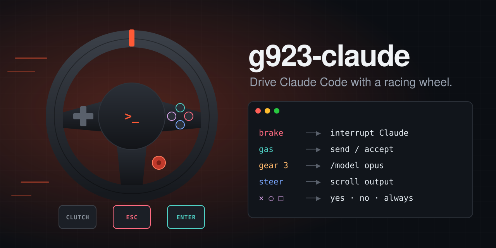

<div align="center">



**Brake to interrupt Claude. Gas to send. Shift gears to switch models. Steer to scroll.**<br>
And the wheel buzzes when Claude needs you.

[](https://github.com/Emperor-Z/g923-claude/actions/workflows/ci.yml)
[](https://github.com/Emperor-Z/g923-claude/releases)
[](pyproject.toml)
[](#install)
[](LICENSE)
[](https://github.com/Emperor-Z/g923-claude/stargazers)

[Quick start](#quick-start) · [Controls](#controls) · [How it works](#how-it-works) · [Other wheels](#supported-hardware) · [Contributing](CONTRIBUTING.md)

</div>

<!-- DEMO: drop a short clip here, e.g. docs/img/demo.gif (pedal → Claude stops, shift → model changes) -->

## Why?

You already have a ~£300 force-feedback controller on your desk, and you spend all day telling an AI agent "yes", "no", "stop" and "keep going". Those are pedal-shaped decisions.

- 🦶 **Feet on the flow:** slam the brake the moment Claude goes off the rails. Gas to approve. No hunting for Esc.
- ⚙️ **Gears are models:** H-pattern shifter maps to Haiku → Sonnet → Opus → Fable. Clutch in, shift, done. Your current gear *is* your current model.
- 🎮 **Thumbs answer prompts:** ✕ yes, ○ no, □ "always allow", same as every PlayStation menu you've ever used.
- 🛞 **Steer to scroll:** the further you turn, the faster it scrolls.
- ⌨️ **Type with the wheel:** a rotary-dial typewriter with word suggestions learned from your own prompts.
- 📳 **It talks back:** Claude Code hooks ping the wheel when Claude finishes or is waiting on a permission prompt.
- 🔒 **Safe by default:** starts disarmed; nothing reaches your keyboard until you press PS.

## Quick start

```bash
git clone https://github.com/Emperor-Z/g923-claude.git
cd g923-claude && ./install.sh
```

Open Claude Code, focus the terminal, press **PS** on the wheel. You're driving.

## Controls

```
            [L-paddle ↑]                         [R-paddle ↓]
   ┌──────────────────────────────────────────────────────────┐
   │    ▲                                           △ todos    │
   │  ◀ ✚ ▶  arrows                       □ always  ○ no/Esc  │
   │    ▼                                           ✕ yes/⏎    │
   │  L2: transcript                        R2: background    │
   │  L3: voice (hold)                      R3: autocomplete  │
   │        [Share: DRIVE]  [Options: TYPE]  + −  ◉dial  ⏎    │
   │                   (PS: ARM / DISARM)                     │
   └──────────────────────────────────────────────────────────┘
   steer left = scroll up · steer right = scroll down (speed ∝ angle)

   Pedals:   [CLUTCH: shift / mode]  [BRAKE: Esc]  [GAS: Enter]
   Shifter:  1 Haiku · 2 Sonnet · 3 Opus · 4 Fable · 5 Opus 1M · 6 opusplan · R rewind
```

### Drive mode (default)

| Control | Sends | In Claude Code |
|---|---|---|
| Gas | `Enter` | Submit / accept highlighted option |
| Brake | `Esc` | Interrupt Claude; decline a permission prompt |
| Clutch (tap) | `Shift+Tab` | Cycle permission mode |
| Clutch + shifter | `/model …` | Change model (see below) |
| Paddles, D-pad ▲▼, dial | `↑` / `↓` | Move through menus and history |
| D-pad ◀▶ | `←` / `→` | Cursor, dialog tabs |
| Dial Enter, ✕ | `Enter` | Submit / Yes |
| ○ | `Esc` | No / close dialog |
| □ | `Shift+Tab` | "Allow for this session" on prompts, else cycle mode |
| △ | `Ctrl+T` | Toggle task checklist |
| L2 | `Ctrl+O` | Transcript viewer |
| R2 | `Ctrl+B` | Background the running command |
| R3 | `Tab` | Accept autocomplete |
| L3 (hold) | `Space` (held) | Voice dictation, if enabled in Claude Code |
| + / − | `/effort …` | Raise / lower reasoning effort |
| Steering | mouse wheel | Scroll the output |
| PS | — | Arm / disarm the whole thing |
| Share / Options | — | Switch to Drive / Type mode |

### Shifter = model

Hold the **clutch** and move the stick, like a real car. Shifting without the clutch is ignored (and grinds), so knocking the stick never changes your model.

| Gear | Model |
|---|---|
| 1 | `haiku` |
| 2 | `sonnet` |
| 3 | `opus` |
| 4 | `fable` |
| 5 | `opus[1m]` (1M context) |
| 6 | `opusplan` |
| R | Rewind (`Esc Esc`) |
| N | no change |

Your draft prompt is stashed (`Ctrl+S`) while the command is sent and restored after, so shifting mid-sentence doesn't lose it. `/model` applies immediately, even while Claude is working: the switch takes effect from Claude's next request. If Claude Code shows a prompt-cache warning, confirm it with the gas pedal.

**+ / −** step reasoning effort through `low → medium → high → xhigh → max` with `/effort`. The daemon assumes you start at `high` (configurable as `[effort] start`).

Gear presets live in `[shifter]` in `config.toml`. Each gear is a list of slash commands, so a gear can set several things at once, for example `gear_6 = ["/model fable", "/effort max"]`.

### Type mode

Press **Options** to type with the wheel; **Share** returns to Drive mode. The character you're choosing is typed straight into the prompt as a live preview and replaced as you scroll.

| Control | Action |
|---|---|
| D-pad ◀▶ | Previous / next character |
| Dial ↻↺ | Same, fast |
| D-pad ▲▼ | Switch set: `abc` → `ABC` → `123` → symbols |
| Dial Enter | Commit the character |
| ✕ | Space |
| ○ | Backspace |
| □ | Next suggested word |
| △ | Accept suggested word |
| Gas / Brake | Still Enter / Esc |

Letters are ordered by frequency (`e t a o i n s r h l …`). The dial keeps its position between characters, so the first press after a commit re-shows the same letter: double letters are one press plus Enter.

**What you see is what you get.** A previewed character or suggested word that's visible in the prompt stays there unless you press ○ to remove it, so ✕, Gas or moving on all keep it.

**Word suggestions.** After two committed letters, a notification shows the top three guesses. □ types the first one inline, and pressing □ again swaps it for the next; △ accepts it and adds a space (if nothing is showing, △ inserts the top guess directly). Guesses come from a built-in list (`g923/words.txt`) blended with words from your own past Claude Code prompts (`~/.claude/history.jsonl`), which are read locally at startup and never written anywhere.

Tips:
- `/` (top of the symbols set) opens Claude Code's command menu and `@` opens the file picker; drive those menus with the paddles and Gas.
- Paddles, pedals, gears and the other buttons keep their Drive mode actions while you type.
- For long prompts, hold L3 for voice dictation instead.

## How it works

```
 G923 ──evdev──▶ g923d (Python daemon, systemd user service)
                   │  maps inputs → virtual keyboard + mouse (uinput) ──▶ focused terminal
                   │
                   ◀── Unix socket ◀── Claude Code hooks (prompt submitted, stop, permission)
                   │
                   └─▶ feedback: force feedback on the wheel, or notification + sound
```

The daemon reads the wheel through evdev and types into whichever window has focus through a virtual uinput keyboard, so it works on any Wayland compositor (GNOME included) and X11. Claude Code hooks report back over a Unix socket so the wheel can react.

## Install

The [quick start](#quick-start) is all most people need. Details:


Requires Linux, Python 3.11+, systemd, and write access to `/dev/uinput` (granted to the logged-in user on most systemd distros).

```bash
git clone https://github.com/Emperor-Z/g923-claude.git
cd g923-claude
./install.sh
```

`install.sh`:
1. creates `.venv` and installs `evdev` (with `uv` if available)
2. adds the Claude Code hooks to `~/.claude/settings.json`, leaving your other hooks alone and saving a backup to `settings.json.g923.bak`
3. installs and starts the `g923d` systemd user service

`./uninstall.sh` stops the service and removes only the g923 hooks.

**From a release (pip):** each [release](https://github.com/Emperor-Z/g923-claude/releases) ships a wheel:

```bash
pipx install https://github.com/Emperor-Z/g923-claude/releases/download/v0.4.0/g923_claude-0.4.0-py3-none-any.whl
g923-hooks            # add the Claude Code hooks
g923d                 # run the daemon
```

Copy `config.toml` to `~/.config/g923-claude/config.toml` to customise it.

**Container (GHCR):** for the curious. Notifications and sounds don't work inside it, so prefer the install script.

```bash
docker run --rm -it --device /dev/uinput --device /dev/input \
  -v "$XDG_RUNTIME_DIR:$XDG_RUNTIME_DIR" -e XDG_RUNTIME_DIR \
  ghcr.io/emperor-z/g923-claude:latest
```

## Claude Code integration

Hooks tell the daemon what Claude is doing via `bin/g923-ping`, a tiny client that talks to the daemon's Unix socket (`$XDG_RUNTIME_DIR/g923.sock`) and silently does nothing if the daemon isn't running.

| Hook | Message | Wheel reaction |
|---|---|---|
| `UserPromptSubmit` | `busy` | — |
| `Stop` | `done` | "complete" chime (force-feedback jolt in phase 5) |
| `PermissionRequest` | `attention` | Notification + warning sound, repeated every 3 s until you answer |
| `PostToolUse` | `clear` | Stops the repeat |

Any wheel or pedal input also counts as answering, so the nagging stops as soon as you hit ✕, ○, Gas or Brake.

## Usage

With the service installed it runs in the background; follow it with `journalctl --user -u g923d -f`. To run it by hand instead (stop the service first):

```bash
bin/g923d              # run the daemon, then press PS to arm
bin/g923d --dry-run    # print what each input would send, without sending it
bin/g923d --dump       # print raw wheel events (find button codes)
bin/g923d --config my.toml
```

Focus the terminal running Claude Code, press **PS**, and drive.

## Tests

```bash
.venv/bin/python -m unittest discover -s tests -t .
```

The tests replay synthetic wheel events through the daemon, so they don't need the wheel connected.

## Safety

Keys go to whichever window is focused. The daemon starts **disarmed** — press **PS** to arm it (you get a notification). Disarm before gaming or using other apps.

## Troubleshooting

- **Nothing happens:** press PS to arm. Check `journalctl --user -u g923d -f` for `connected:`.
- **`Permission denied` on `/dev/uinput`:** add a udev rule: `KERNEL=="uinput", TAG+="uaccess"` in `/etc/udev/rules.d/60-uinput.rules`, then `sudo udevadm control --reload && sudo udevadm trigger`.
- **Wheel not found:** run `bin/g923d --dump`; if your wheel's name doesn't contain "G923", set `[device] name_match`.
- **Wrong buttons:** run `bin/g923d --dump`, press the button, and fix its code in `[buttons]`.
- **No notifications or sounds:** install `libnotify` (notify-send) and `libcanberra` (canberra-gtk-play).
- **Keys go to the wrong window:** they always go to the focused window. Disarm (PS) before switching apps.

## Roadmap

- [x] Phase 0 — skeleton, config, README
- [x] Phase 1 — daemon core, Drive mode, steering scroll, arm/disarm
- [x] Phase 2 — clutch + shifter model switching, effort
- [x] Phase 3 — Type mode with word suggestions
- [x] Phase 4 — Claude Code hooks, feedback, systemd service, installer
- [ ] Phase 5 — force feedback via the new-lg4ff driver

## Supported hardware

| Device | Status |
|---|---|
| Logitech G923 PlayStation/PC (`046d:c266`) | ✅ Fully mapped |
| Logitech Driving Force Shifter | ✅ Model switching |
| Logitech G923 Xbox/PC (`046d:c26e`) | 🟡 Should work, button codes differ |
| Logitech G29 / G920 | 🟡 Same layout family, needs a config |
| Thrustmaster, Fanatec, Moza, anything evdev | 🙋 Help wanted |

Everything device-specific lives in [`config.toml`](config.toml). Supporting a new wheel usually means running `bin/g923d --dump`, pressing each button, and filling in `[buttons]` and `[pedals]`. **If you get your wheel working, please open a PR with your config.** See [CONTRIBUTING.md](CONTRIBUTING.md).

## FAQ

**Is this a joke?** It started as one. Then braking to stop a runaway refactor turned out to be really satisfying.

**Does it work on macOS or Windows?** Not yet. It relies on Linux evdev and uinput. A port is a welcome contribution.

**Does it send my data anywhere?** No. Word suggestions read your local `~/.claude/history.jsonl` at startup, in memory only. The hooks only talk to a local Unix socket.

**Will it type into the wrong window?** Keys go to whatever is focused, which is why it starts disarmed. Press PS to toggle.

**Can I remap everything?** Yes. Every button, pedal threshold, gear preset and type-mode key is in `config.toml`.

## Contributing

Bug reports, wheel configs and new feedback ideas are all welcome. Start with [CONTRIBUTING.md](CONTRIBUTING.md). If this made you smile, a ⭐ helps other people find it.

## Star history

[](https://star-history.com/#Emperor-Z/g923-claude&Date)

## License

[MIT](LICENSE). Not affiliated with Logitech or Anthropic. "G923" and "Claude" are trademarks of their respective owners.
